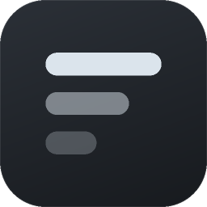
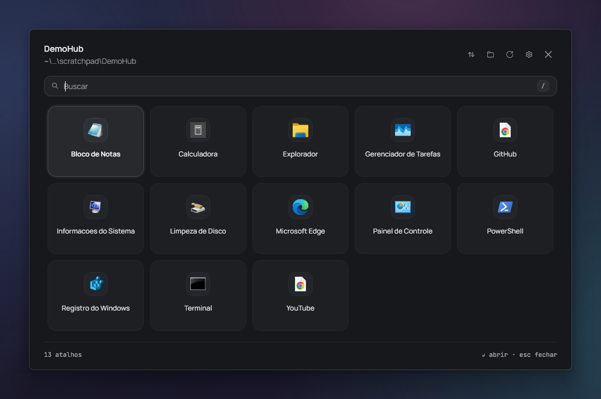
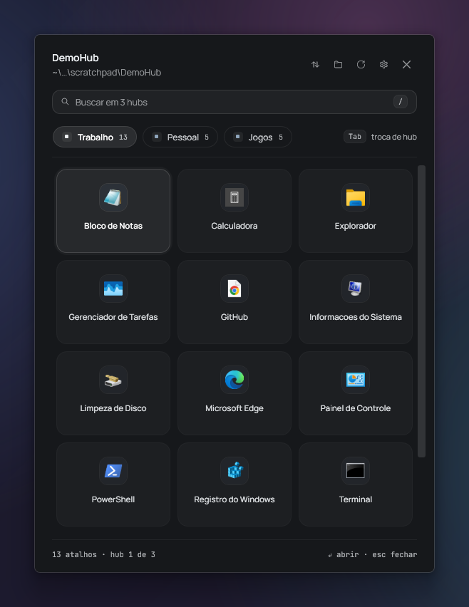

<div align="center">



# FolderHub

**A pasta é a configuração.**
Um mini launcher para Windows 11 que transforma qualquer pasta de atalhos num hub visual.

Sem cadastro de app, sem banco de dados, sem lista de programas no código.
Colocou um atalho na pasta, aparece. Apertou `Ctrl+Alt+Space`, ele está lá em 60 ms.

[](https://github.com/Rudhery/FolderHub/actions/workflows/build.yml)
[](LICENSE)
[](https://dotnet.microsoft.com/)

[English](README.md)



</div>

---

**[Instalando](#instalando)** · **[Abas](#abas)** · **[Ordenando](#ordenando)** ·
**[Teclado](#teclado)** · **[Configuração](#configuração)** ·
**[Desempenho](#desempenho)** · **[Temas](#temas)** ·
**[Como foi feito](#como-foi-feito)** · **[Contribuindo](CONTRIBUTING.md)**

## Repositório

```
app/     o launcher em si — WPF, .NET 10
web/     a landing page (ainda não feita)
docs/    as imagens usadas neste README
```

## A ideia

Você aponta o FolderHub para uma pasta. Ele lê nome e ícone de cada atalho lá dentro,
monta tudo em cards e executa o que você clicar.

Não existe cadastro de app, nem banco de dados, nem lista de programas no código.
**Colocou um atalho na pasta, aparece. Apagou, some.** A pasta que você já organiza no
Explorer *é* a configuração, e o app fica de olho nela em tempo real.

Essa restrição guia o projeto inteiro — inclusive a ordenação: arrastar um card renomeia
os arquivos com prefixo `01 - `, `02 - `, então a ordem que você define no app é a mesma
que aparece no Explorer, e vice-versa.

## O que ele faz

- **Atalho global** — `Ctrl+Alt+Space` abre o hub de qualquer lugar, com o app na bandeja.
- **Lê qualquer atalho** — `.lnk`, `.url`, `.exe`, `.bat`, `.cmd`, `.ps1`, `.appref-ms`, `.msc`.
- **Acrílico nativo do Windows 11**, cantos arredondados e modo escuro via DWM.
- **Ícones nítidos** — 256px pela Shell API, em vez dos 32px borrados que a maioria usa.
- **Grade adaptativa** — colunas e tamanho da janela seguem a quantidade de atalhos.
- **Digite para filtrar**, setas para navegar, `Enter` para abrir.
- **Arraste para reordenar**, e a ordem é gravada na própria pasta.
- **Arrastar e soltar** — solte uma pasta para trocar de hub, solte programas para adicionar.
- **Abas** — várias pastas num hub só, cada uma carregada só quando você abre.
- **Vários hubs** — um atalho por pasta, cada um fixável na barra de tarefas.
- **Ao vivo** — adicionou ou removeu um atalho com o hub aberto, ele se atualiza sozinho.

## Instalando

Baixe o `FolderHub-Setup-x.y.z.exe` em [Releases](https://github.com/Rudhery/FolderHub/releases)
e execute. A instalação é por usuário, então **não pede admin**, e oferece iniciar com o
Windows para o atalho global estar sempre disponível.

Ou compile você mesmo:

```powershell
git clone https://github.com/Rudhery/FolderHub.git
cd FolderHub\app
.\publish.ps1                 # dist\FolderHub.exe, ~700 KB, precisa do .NET 10 Desktop Runtime
.\publish.ps1 -SelfContained  # ~124 MB, roda em qualquer Windows 11 sem instalar nada
.\publish.ps1 -Installer      # build autocontida + o instalador (precisa do Inno Setup 6)
```

Na primeira execução ele pergunta qual pasta usar e guarda a escolha.

## Usando

### Fixar na barra de tarefas

O instalador cria um atalho no menu Iniciar — clique com o botão direito nele e escolha
**Fixar na barra de tarefas**. Fixar um `.exe` puro é instável no Windows 11, e um `.exe`
fixado sempre abre sem argumentos, que é justamente o que atrapalha quando você tem mais
de um hub.

### Abas

Um hub não é uma pasta só. Liste as pastas na config e cada uma vira uma aba:

```jsonc
"tabs": [
  { "path": "D:\\Trabalho", "name": "Trabalho" },
  { "path": "D:\\Jogos",    "name": "Jogos" },
  { "path": "D:\\Ferramentas" }         // sem nome = o nome da pasta
]
```

Solte uma pasta na janela para somar uma, clique com o direito numa aba para
remover. Com uma aba só a faixa fica escondida, então um hub de pasta única
continua exatamente como era.

**O carregamento é preguiçoso onde realmente custa.** Na abertura cada aba faz
uma contagem barata — só lê a extensão dos nomes, nenhum arquivo é aberto — e é
ela que dimensiona a janela para a maior aba, para a janela nunca mudar de
tamanho quando você troca. A listagem de verdade, e principalmente a extração dos
ícones, acontece na primeira vez que você abre a aba. Depois os ícones ficam no
cache da própria aba, então voltar é instantâneo.



### Mais de um hub

Passe a pasta e faça um atalho para cada:

```powershell
FolderHub.exe "D:\Jogos"
FolderHub.exe "D:\Trabalho\Ferramentas"

# ou deixe o script montar
.\app\tools\create-shortcut.ps1 -Folder "D:\Jogos" -Name "Hub de Jogos" -Desktop
```

O argumento nunca sobrescreve a pasta padrão salva na configuração.

### Modo residente

O modo residente é o que faz o atalho global existir: ele mantém o FolderHub na bandeja
escutando, em vez de encerrar depois de abrir um app.

| Flag | Efeito |
|---|---|
| `--resident` | residente e visível - é o que o instalador executa no fim |
| `--background` | residente e escondido - é o que a entrada de logon usa |

Qualquer uma das duas fica gravada, então a partir daí abrir o FolderHub de qualquer
jeito mantém o atalho vivo. Dá para ligar e desligar também com o botão direito no
cabeçalho do hub.

Residente existe um processo só — clicar num atalho fixado apenas pede para o que já está
rodando aparecer, na pasta daquele atalho.

### Ordenando

O botão de ordenar no cabeçalho oferece **Manual**, **Nome (A→Z)**, **Nome (Z→A)** e
**Mais recentes**, além de *Gravar esta ordem na pasta*.

No modo manual você arrasta os cards e o FolderHub renomeia os arquivos:

```
01 - Steam.lnk        ->  Steam
02 - Discord.lnk      ->  Discord
03 - OBS.lnk          ->  OBS
```

O prefixo nunca aparece no card. Ordenar renomeando na mão pelo Explorer continua
funcionando, e ele aceita `01 -`, `01.`, `01_` e `01)`.

### Teclado

| Tecla | Ação |
|---|---|
| `Ctrl+Alt+Space` | mostra / esconde o hub (modo residente) |
| digitar | filtra |
| `←` `↑` `→` `↓` | navega entre os cards |
| `Enter` | abre o card selecionado |
| `Esc` | limpa a busca; se já estiver vazia, fecha |
| `F5` | recarrega e relê os ícones |
| `Ctrl+Tab` / `Ctrl+Shift+Tab` | próxima / aba anterior |
| `Ctrl+1` … `Ctrl+9` | vai direto para uma aba |
| `Ctrl+O` | troca a pasta da aba ativa |
| botão direito num card | executar como administrador / mostrar na pasta |
| botão direito no cabeçalho | modo residente, iniciar com o Windows, abrir a config |
| duplo clique no cabeçalho | abre a pasta no Explorer |

## Configuração

`%APPDATA%\FolderHub\config.json`

```jsonc
{
  "tabs": [                    // uma pasta por aba
    { "path": "D:\\Jogos", "name": "Jogos" },
    { "path": "D:\\Trabalho" }
  ],
  "background": true,          // fica na bandeja ouvindo o atalho
  "hotKey": "Ctrl+Alt+Space",  // ex.: "Alt+Q", "Win+Shift+H"
  "closeAfterLaunch": true,    // some depois de abrir um app
  "closeOnBlur": false,        // some quando perde o foco
  "sort": "Manual",            // Manual | NameAsc | NameDesc | Recent
  "maxColumns": 7,
  "themeFile": null            // caminho de um .xaml que sobrescreve o tema
}
```

Um `"folderPath"` antigo é migrado para uma aba única na primeira abertura.
O que o app engole em silêncio fica registrado em
`%APPDATA%\FolderHub\folderhub.log`.

## Desempenho

Medido numa pasta de cópias de atalhos reais, então cada card é uma extração de
ícone distinta — o pior caso.

| Atalhos | Janela abre | Ícones prontos | Working set | Privado |
|---|---|---|---|---|
| 13 | 0,59 s | 3,9 s | 192 MB | 126 MB |
| 100 | 0,62 s | — | 254 MB | 182 MB |
| 300 | 0,81 s | 5,5 s | 224 MB | 161 MB |
| 800 | 1,51 s | 5,5 s | 297 MB | 229 MB |

Mas o que importa num launcher é o estado residente:

| | |
|---|---|
| atalho apertado → janela na tela | **61–73 ms** |
| parado na bandeja, por 6 s | **0 ms de CPU** |
| parado na bandeja | **29 MB** de working set |
| handles | ~600, estável independente do tamanho da pasta |

Duas coisas levaram a isso. O ícone é guardado em 96px e não em 256px — o card
desenha em 28px, então 256 significava manter 256 KB por atalho para jogar 95%
dos pixels fora, o que sozinho dava 200 MB numa pasta de 800. E a extração é
dividida entre algumas threads STA em vez de uma.

O que ainda falta é virtualização: todo card é materializado, então passando de
algumas centenas de atalhos os próprios containers começam a pesar. O painel
virtualizado do WPF não quebra linha, então isso exigiria um painel próprio — e
a seleção, o arrastar-para-reordenar e a animação de entrada assumem containers
de verdade. Não compra nada no tamanho em que um launcher é realmente usado,
então não foi feito.

---

## Temas

`themeFile` aponta para um `ResourceDictionary` carregado depois do tema embutido,
então tudo que ele definir vence. Cores, e o tamanho do card do qual a janela se
dimensiona, sem recompilar:

```xml
<ResourceDictionary xmlns="http://schemas.microsoft.com/winfx/2006/xaml/presentation"
                    xmlns:x="http://schemas.microsoft.com/winfx/2006/xaml"
                    xmlns:sys="clr-namespace:System;assembly=System.Runtime">
  <SolidColorBrush x:Key="Surface" Color="#DB16181D" />
  <SolidColorBrush x:Key="TileBg" Color="#1E2126" />
  <sys:Double x:Key="CardWidth">180</sys:Double>
</ResourceDictionary>
```

`app/themes/example.xaml` já vem pronto para copiar, e as chaves são as mesmas de
`app/src/FolderHub/Themes/HubTheme.xaml`. Tema quebrado é registrado no log e
ignorado, não derruba o app. O arquivo é carregado como XAML, então trate com a
mesma confiança da config que aponta para ele.

## Design

A interface segue um sistema monocromático e frio, **sem cor de destaque** — toda a
hierarquia vem de branco em opacidades diferentes sobre o acrílico.

| | |
|---|---|
| superfície | `rgba(26,28,32,0.86)` sobre acrílico, borda `rgba(255,255,255,0.07)` |
| card | `rgba(255,255,255,0.028)` · hover `0.065` · selecionado `0.075` + anel de 2px |
| bloco do ícone | `#22252A` → `#282C32` → `#2C3138`, 44px, raio 12 |
| texto | `#EEF1F4` em 100 / 88 / 58 / 42% |
| transição | 150 ms em fundo e borda — sem deslocamento, sem brilho |
| tipografia | Manrope 400/500/600 · JetBrains Mono nos metadados |

As duas fontes ficam embutidas no executável (SIL OFL, licenças em
`app/src/FolderHub/Assets/Fonts`), então o app não depende de nada instalado na máquina.

Os cantos da janela são os ~8px que o próprio Windows aplica, não um raio customizado:
um raio maior exigiria recortar a janela por conta própria, e o acrílico do sistema iria
embora junto.

O ícone — três barras empilhadas, os atalhos dentro do hub — é arte gerada:

```powershell
python app/tools/make-icon.py   # escreve Assets/folderhub.ico, de 16px a 256px
```

## Como foi feito

WPF em .NET 10, sem dependências externas.

```
app/src/FolderHub/
  App.xaml.cs               inicialização, argumentos, instância única
  MainWindow.xaml(.cs)      a janela em si: carga, busca, teclado, dimensionamento
  MainWindow.Tabs.cs        as abas e o carregamento preguiçoso
  MainWindow.Reorder.cs     menu de ordenação e arrastar para reordenar
  MainWindow.DragDrop.cs    soltar pastas e arquivos na janela
  MainWindow.Background.cs  bandeja, atalho global, mostrar/esconder
  Themes/
    HubTheme.xaml           cor, forma, tipografia e medida
    HubControls.xaml        os modelos — sem literal, só tokens
  Controls/                 os controles da casa: card, aba, ícone, tecla,
                            espaçamento e movimento
  Services/
    FolderScanner.cs        lê a pasta e aplica o modo de ordenação
    GridLayout.cs           quantas colunas e linhas, como matemática pura
    ItemFilter.cs           a busca, ignorando acento
    PathDisplay.cs          encurta o caminho para o cabeçalho
    IconLoadQueue.cs        a thread STA dedicada que extrai os ícones
    IconLoader.cs           extração de ícone em alta resolução
    ManualOrder.cs          grava a ordem renomeando os arquivos
    Launcher.cs             executa o atalho
    ShortcutWriter.cs       cria .lnk ao arrastar algo pra dentro
    GlobalHotKey.cs         RegisterHotKey e o parser de "Ctrl+Alt+Space"
    TrayIcon.cs             Shell_NotifyIcon
    SingleInstance.cs       mutex + mensagem para a instância que já roda
    WindowEffects.cs        acrílico, cantos arredondados, modo escuro
    Log.cs                  log em arquivo, para falha engolida deixar rastro
  Interop/Native.cs         DWM, Shell, GDI, user32
app/tests/FolderHub.Tests/  xUnit
app/tools/                  gerador de ícone, script de atalho
app/themes/example.xaml     ponto de partida para um tema próprio
app/installer/FolderHub.iss Inno Setup
```

Decisões que valem citar:

- **Ícones em 256px.** `IShellItemImageFactory` no lugar do `ExtractAssociatedIcon` de 32px.
  Para `.lnk` o alvo é resolvido antes, então o card mostra o ícone limpo do programa, sem
  a setinha de atalho por cima; para `.url` o `IconFile` do arquivo é lido direto.
- **Ícones carregam numa thread STA dedicada**, porque o COM do Shell é apartment-threaded.
  A janela abre na hora e os ícones entram conforme ficam prontos.
- **Cada estado do card é uma camada que faz cross-fade.** Cada camada carrega a cor exata
  do design; sobrepor uma cor translúcida na outra somaria os alfas e o resultado ficaria
  mais claro do que o especificado.
- **A barra de rolagem é sobreposta.** A padrão do WPF ocupa 10px quando aparece — o
  bastante para a grade perder uma coluna, reorganizar e aí precisar rolar ainda mais.
- **A altura da janela vem do conteúdo** (`SizeToContent`), com a grade em altura explícita.
  Estimar cabeçalho e rodapé em pixels depende das métricas da fonte, e errar por 2px já
  disparava o problema acima.
- **A reordenação renomeia em duas fases**, porque o nome final de um arquivo pode ser o
  nome atual de outro. Se algo falhar no meio, ela desfaz.
- **`ShowInTaskbar` é decidido antes do handle existir** — mudar depois faz o WPF recriar o
  HWND, e o atalho global e o hook de mensagens ficariam órfãos sem avisar.
- **Esconder devolve a memória.** Residente e parado, o hub não precisa das páginas na
  RAM: ao esconder ele coleta e devolve o working set, saindo de ~160 MB para ~25 MB. A
  janela e os ícones continuam montados, então a próxima abertura segue instantânea.

## Testes

```powershell
dotnet test app/FolderHub.sln
```

66 testes sobre a lógica pura: o que o scanner recolhe, os quatro modos de ordenação
(incluindo ordenação natural, para `Item2` vir antes de `Item10`), o renomeio da ordem
manual com o caso de colisão, o parser do atalho, a migração da config de pasta única
para abas, a matemática das colunas, a busca sem acento e o encurtamento de caminho.

## Por que não um serviço do Windows?

Porque serviço não consegue fazer isso. Serviço roda na sessão 0, isolada da área de
trabalho desde o Windows Vista — sem interface, sem acesso à sessão do usuário e sem como
registrar um atalho de teclado para ela. Tudo que "roda em segundo plano" com ícone na
bandeja e tecla de atalho é um processo normal da sessão do usuário iniciado no logon, que
é exatamente o modo residente.

## Licença

MIT — veja [LICENSE](LICENSE).

---

<div align="center">

[Contribuindo](CONTRIBUTING.md) · [Changelog](CHANGELOG.md) ·
[Segurança](SECURITY.md) · [English](README.md)

Feito por [Rudhery Hotz](https://github.com/Rudhery)

</div>
